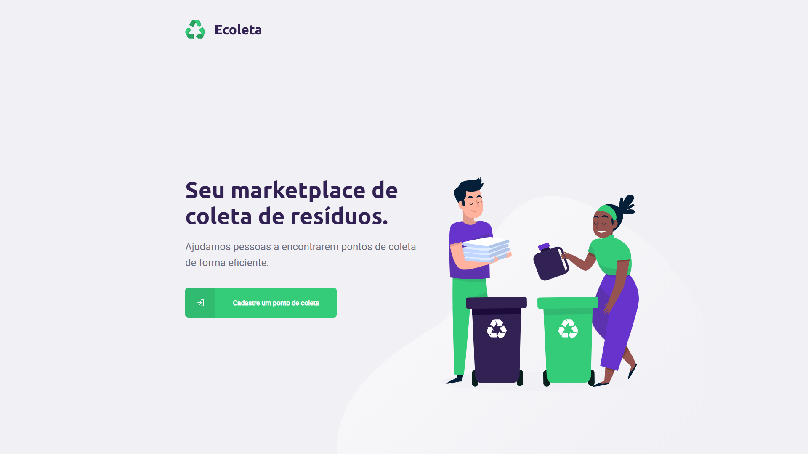
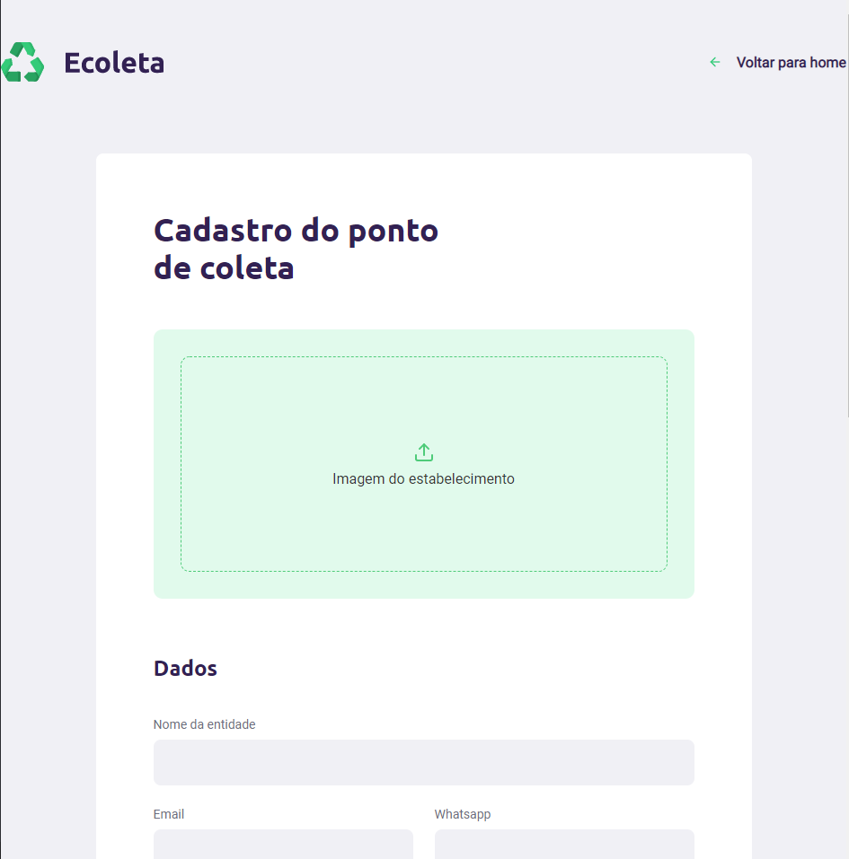
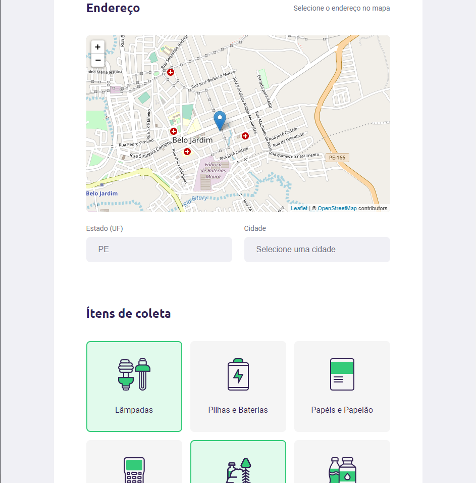
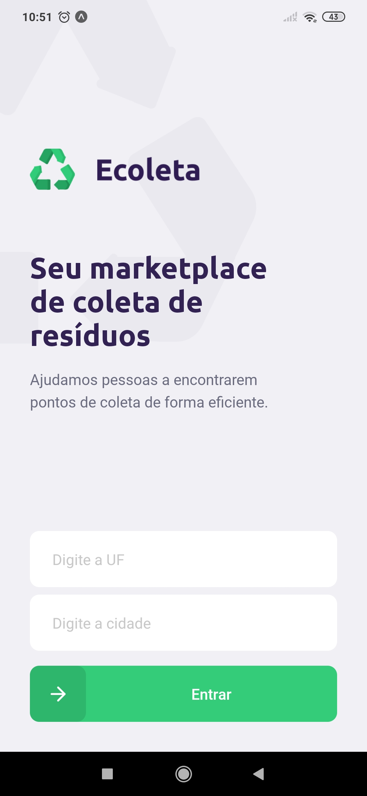
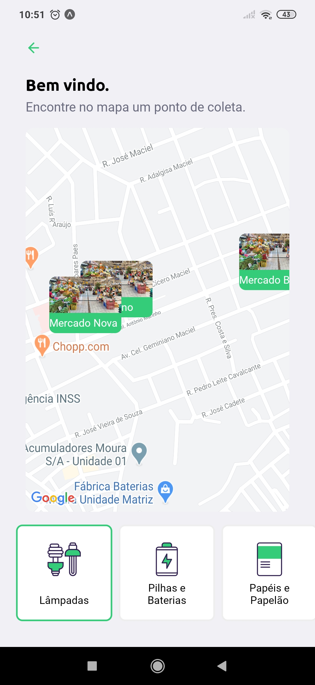
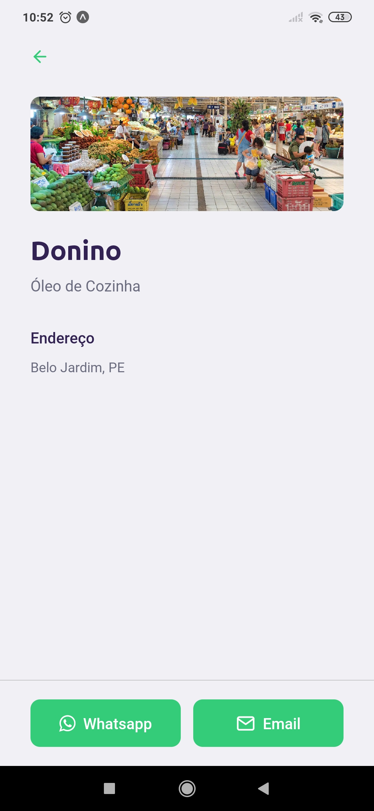

<div align="center">

</div>

<p>Ecoleta is an app that helps you find the nearest recycling points. It's an open source project developed during the first Next Level Week edition by @Rocketseat</p>

<h3>WEB screenshots</h3>
<div align="center">
  
  
  
</div>

<h3>MOBILE screenshots</h3>
<div align="center">
  
  
  
</div>

## 📜 About
This project helps people find the nearest spots that collects recycling items. These spots can be registered in the website adding their informations such as contact, and 
location. In the mobile app, the user is able to filter collecting Points in the map by the city and the type of items collected. This repo contaims the code from both the frontend 
and the backend API that serves the web and mobile applications.

## 💻 Techs
* [NodeJS](https://nodejs.org/en/)
* [Typescript](https://www.typescriptlang.org/) 
* [Express](https://expressjs.com/) 
* [Knex.js](http://knexjs.org/)
* [React](https://reactjs.org/)   
* [React Native](https://reactnative.dev/) 
* [Expo](https://expo.io/)     
* [React-Native-Maps](https://github.com/react-native-community/react-native-maps)
* [React-Leaflet](https://react-leaflet.js.org/)
* [API Localidades-IBGE](https://servicodados.ibge.gov.br/api/docs/localidades?versao=1)
 

## 🛠 Getting started
First of all, clone this repo with ````git clone https://github.com/Gust4voSales/Ecoleta-NLW-1.git```` 
* #### Running the backend 
1. Run ````npm install```` inside server folder to install all dependecies
2. Then ````npm run knex:migrate```` to run the database migrations and create the tables
3. Followed by ````npm run knex:seed```` to seed the database with the default items
4. Finally ````npm run dev```` to run the api

* #### Running the web project
1. Run ````yarn```` inside web folder to install all dependecies 
2. ````yarn start```` to run the web aplication
* #### Running the mobile project
1. Run ````yarn```` inside mobile folder to install all dependecies
2. ````yarn start```` to run the mobile aplication (expo is required in your machine) 
3. Change the baseURL link in the file: src/services/api.ts (Add your own IP address, you can check it in the Expo web console that opens once you run the app)
